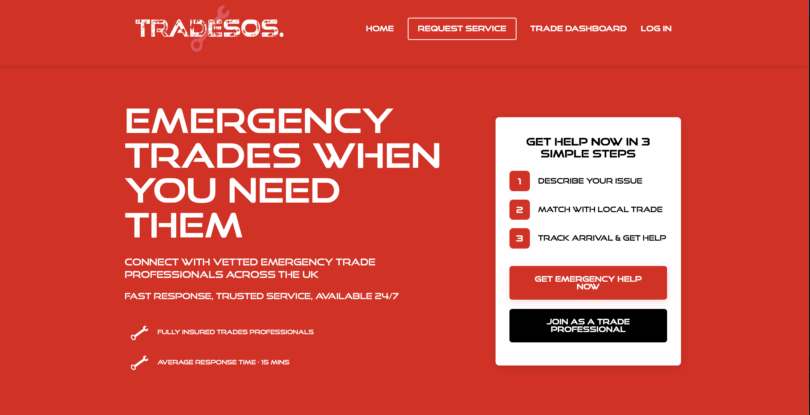
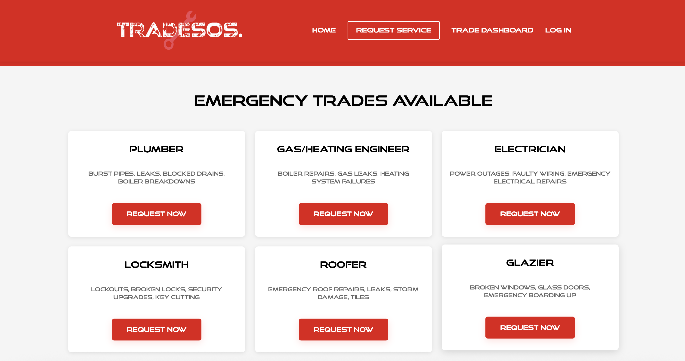
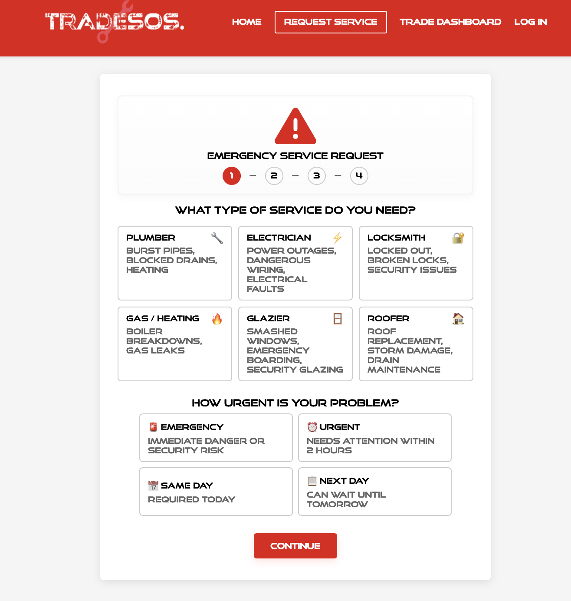
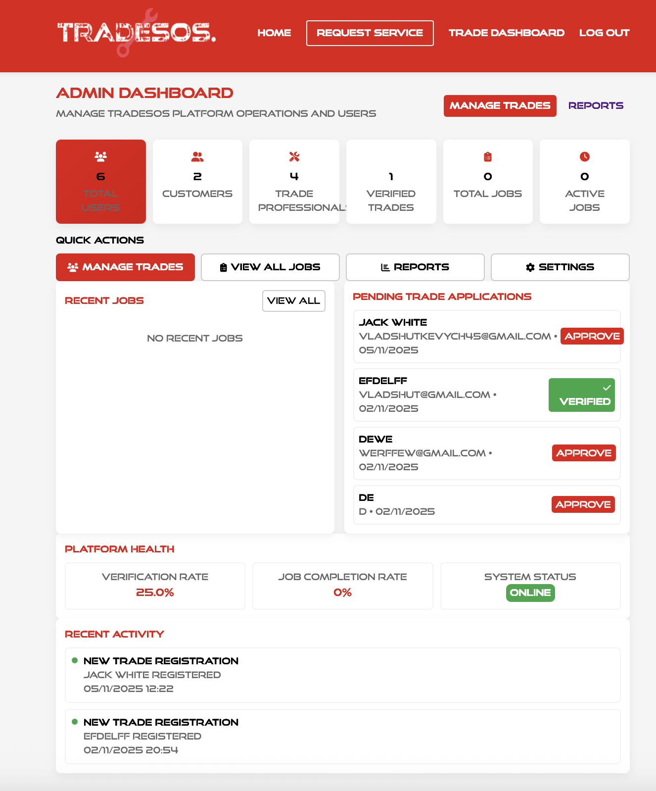

# TradeSOS

   
  <em>Main page: welcome and entry into emergency requests.</em>

   
  <em>Emergency trades: urgency-aware listings for rapid response.</em>

   
  <em>Service request: structured intake with files, photos, and notes.</em>

   
  <em>Admin dashboard: oversight of jobs, trades, billing, and escalations.</em>

⚡️ Emergency trade callouts across the UK, built on Flask  
🛰️ Real-time matching, location pings, and urgency-aware SLAs  
💳 Stripe-powered subscriptions with admin tools and secure messaging  

## 🚀 Overview
TradeSOS is an emergency trade services platform that connects customers needing urgent repairs to verified professionals. Built with Flask, SQLAlchemy, and Stripe, it prioritizes speed, trust, and operational control: role-based access, urgency-aware routing, location tracking, secure messaging, and subscription billing to keep trades responsive and customers informed.

## 💡 Core Features
### 📍 Matching & Job Flow
- UK postcode parsing, validation, and geocoding with radius-based trade matching.
- Urgency ladder (emergency_now, urgent_2h, same_day, next_day) with SLA timers and status updates.
- Premium-first access window so top subscribers see jobs before standard trades.
- Job lifecycle tracking with photos, attachments, and audit-friendly history.

### 💬 Collaboration & Customer Experience
- In-app messaging between customers and trades with optional email notifications.
- Location pings per job with TTL cleanup for privacy.
- Structured forms via WTForms with validation and secure file handling.

### 💳 Billing & Operations
- Stripe-powered subscription checkout, webhooks, and plan management.
- Role-aware dashboards for Customers, Trades, and Admins with route guards.
- Admin tooling for job review, payment oversight, and trade verification.

### 🔒 Trust & Safety
- Password hashing, session management with Flask-Login, and CSRF protection scaffolded.
- Secure filename handling and file-type validation for uploads.
- Configurable environment variables for secrets, storage, mail, and billing.

## 🏗️ Architecture
Flask + Jinja2 UI (Bootstrap 5)  
→ Auth & Roles (Customer, Trade, Admin) via Flask-Login  
→ Business Logic (urgency SLAs, premium window, job lifecycle)  
→ Persistence via SQLAlchemy ORM (SQLite dev, PostgreSQL ready)  
→ Integrations: Stripe billing, SMTP/email notifications, geocoding stub  
→ Real-time UX: WebSocket-ready messaging and location updates

## 🛠️ Tech Stack
| Layer | Technologies |
| --- | --- |
| Web | Flask, Jinja2, Bootstrap 5, Vanilla JS |
| Data | SQLAlchemy ORM, Flask-Migrate, SQLite (dev), PostgreSQL (prod-ready) |
| Auth | Flask-Login, role-based access (Customer/Trade/Admin) |
| Billing | Stripe subscriptions, webhooks, plan pricing config |
| Forms | WTForms, CSRF protection scaffold |
| Messaging & Files | In-app messaging, uploads with secure filenames |
| Infra | Dockerfile + docker-compose, environment-driven config |

## 🌟 What Sets It Apart
- Built for emergency SLAs: urgency-aware routing, timers, and premium-first access.
- Trust-first UX: verified trades, role separation, and location sharing scoped to active jobs.
- Operational visibility: Stripe-backed billing, audit-friendly job history, and admin oversight.
- Privacy-aware location: TTL-bound pings and guarded sharing per job context.
